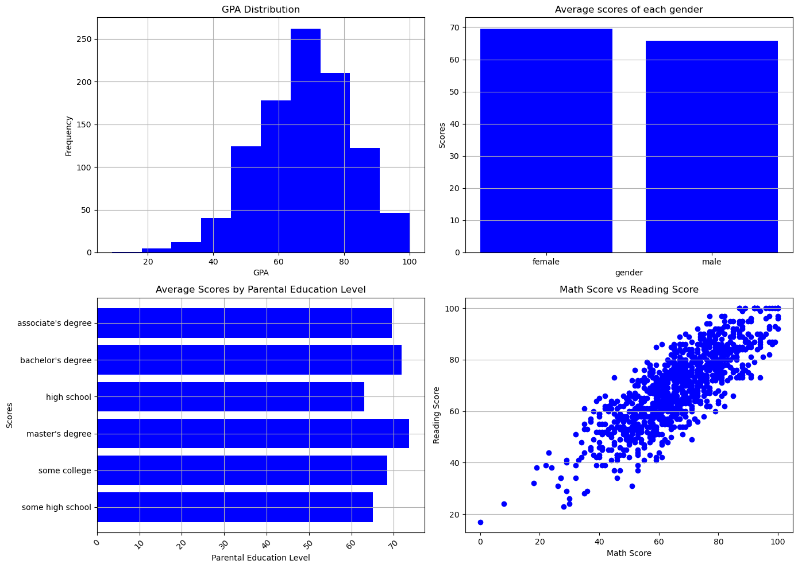

# 📊 Student Performance EDA

An Exploratory Data Analysis (EDA) project on the **Students Performance** dataset using **Python, Pandas, and Matplotlib**.

The main goal of this project is to explore student performance, identify meaningful patterns, and visualize relationships between different educational factors.



---

## 📌 Project Objectives

- Explore the dataset structure
- Clean and prepare the data
- Create a new **GPA** feature from the three exam scores
- Perform statistical analysis
- Visualize important insights
- Build a simple analytical dashboard

---

## 🛠️ Technologies Used

- Python
- NumPy
- Pandas
- Matplotlib
- Jupyter Notebook

---

## 📂 Project Structure

```text
Student-Performance-EDA/
│
├── student_eda.ipynb
├── StudentsPerformance.csv
├── README.md
└── images/
```

---

## 📈 Analysis Performed

The project includes analyses such as:

- Dataset overview
- Missing value inspection
- Statistical summary
- GPA feature engineering
- GPA distribution
- Average GPA by gender
- Average GPA by parental education level
- Relationship between Math and Reading scores
- Dashboard summarizing the key findings

---

---

## 📊 Dashboard

The final dashboard includes visualizations for:

- Student GPA Distribution
- Average GPA by Gender
- Average GPA by Parental Education Level
- Math Score vs Reading Score

---

## 🔍 Key Findings

- Female students achieved a higher average GPA than male students.
- Higher parental education was generally associated with better student performance.
- Students who completed the preparation course scored higher on average.
- Math and Reading scores showed a positive correlation.
- Most students' GPAs were concentrated around the middle score range.

---

## 🚀 Getting Started

Clone the repository:

```bash
git clone https://github.com/omood14/student-performance-eda.git
```

Install the required libraries:

```bash
pip install numpy pandas matplotlib
```

Launch Jupyter Notebook:

```bash
jupyter notebook student_eda.ipynb
```

---

## 📚 Dataset

**Students Performance Dataset**

---

## 👨‍💻 Author

**Omid Dadashzadeh**

Computer Engineering Student | Aspiring AI & Machine Learning Engineer

---

⭐ If you found this project useful, consider giving it a star.

